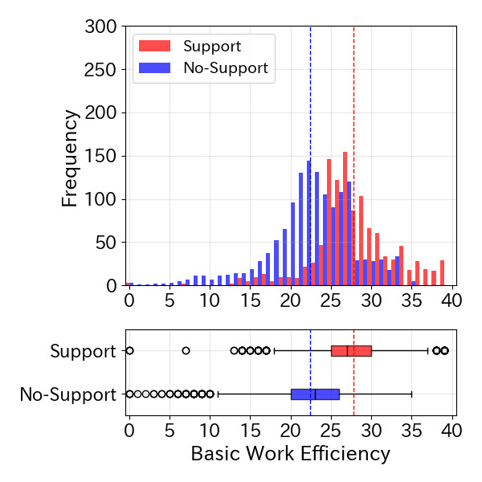

# 📂 Graph - README

## 🧾 概要

このディレクトリは、**提案システムによる採点作業支援**の成果を可視化・分析するためのスクリプトおよび関連ファイルを格納しています。加速度センサやカメラなどから得られたデータを集計し、ヒストグラムや箱ひげ図などで出力します。

主な目的は以下の通りです：

- 各被験者ごとの支援ありと支援なしの可視化
- 実験結果の分析（例：効率の変化、集中度の時間的推移）
- 提案システムの定量的評価

---

## 📁 ディレクトリ構成
    Graph/ 
    ├── histogram.py # 採点結果をグラフで表示するメインスクリプト 
    ├── requirements.txt # 仮想環境に必要なPythonライブラリ一覧
    └── README.md # 本ファイル

## 🚀 実行手順

### 1. 🛠 仮想環境のセットアップ

1. 仮想環境を作成します（初回のみ）：
    ```bash
    python -m venv myenv
    ```

2. 仮想環境を有効にします：

    - Mac/Linux：
      ```bash
      source myenv/bin/activate
      ```

    - Windows：
      ```bash
      myenv\Scripts\activate
      ```

3. 依存ライブラリをインストールします：
    ```bash
    pip install -r requirements.txt
    ```

> ※ Python 3.8 〜 3.10 あたりを推奨します。

### 2. 🛠 実行
    python3 histogram.py
    出力例
    被験者の番号を入力(0~14):
    